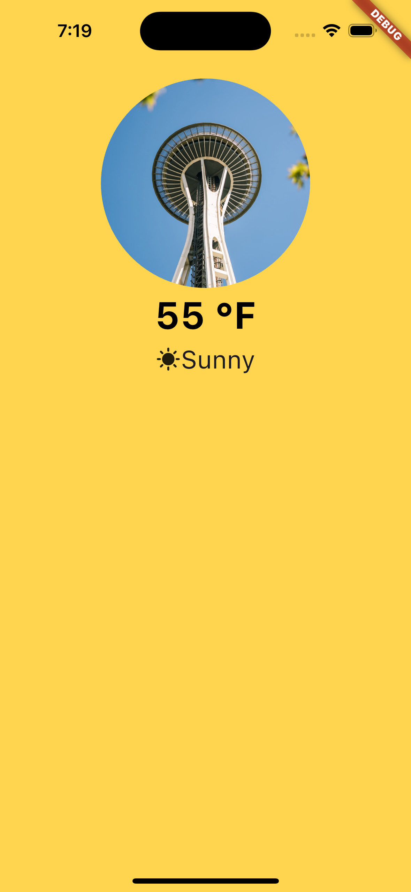

# Basic Weather App

The **Basic Weather App** is a Flutter application that shows the current weather based on the user's location. This focuses on core Flutter development, API integration, and user-friendly UI.

# Features
- **Current Location**: Automatically fetches the user's geolocation
- **Weather Data**: Retrieves and displays real-time weather data including:
  - Temperature
  - Weather condition
  - City/Location name
- **Dynamic UI**: Clean interface that adapts to weather conditions
- **Accessibility**: Includes semantic labels and follows WCAG guidelines for mobile apps

## Screenshot

<

## Technologies Used
- **Flutter & Dart**
- `http` - to fetch weather data from an external API
- `geolocator` - to determine user's current location
- `provider` - for state management
- `intl` - for formatting date/time

## Project Structure

```text
lib/
├── main.dart
├── models/
│   └── weather.dart
├── providers/
│   └── weather_provider.dart
├── screens/
│   └── home_page.dart
├── services/
│   ├── weather_service.dart
│   └── location_service.dart
└── widgets/
    └── weather_card.dart
```
## Getting Started
1. **Clone the repo**
   ```bash
   git clone https://github.com/laurxntra/weather-app.git
   cd weather-app
2. **Install dependencies**
   ```bash
   flutter pub get
3. **Run the app**
   ```bash
   flutter run
